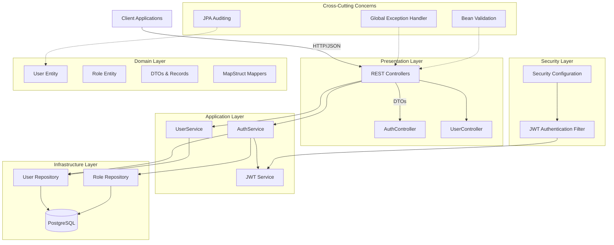
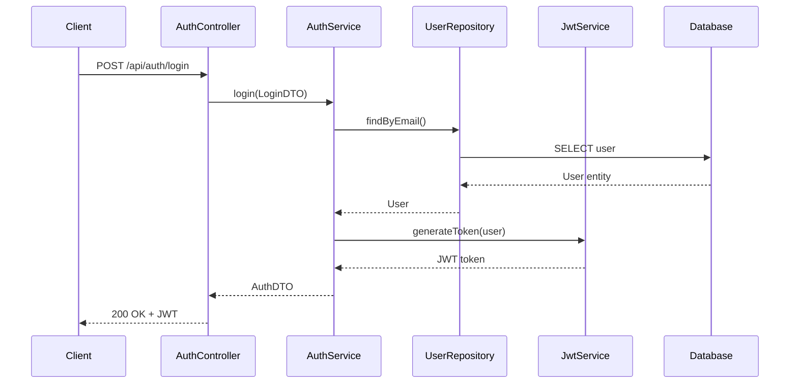
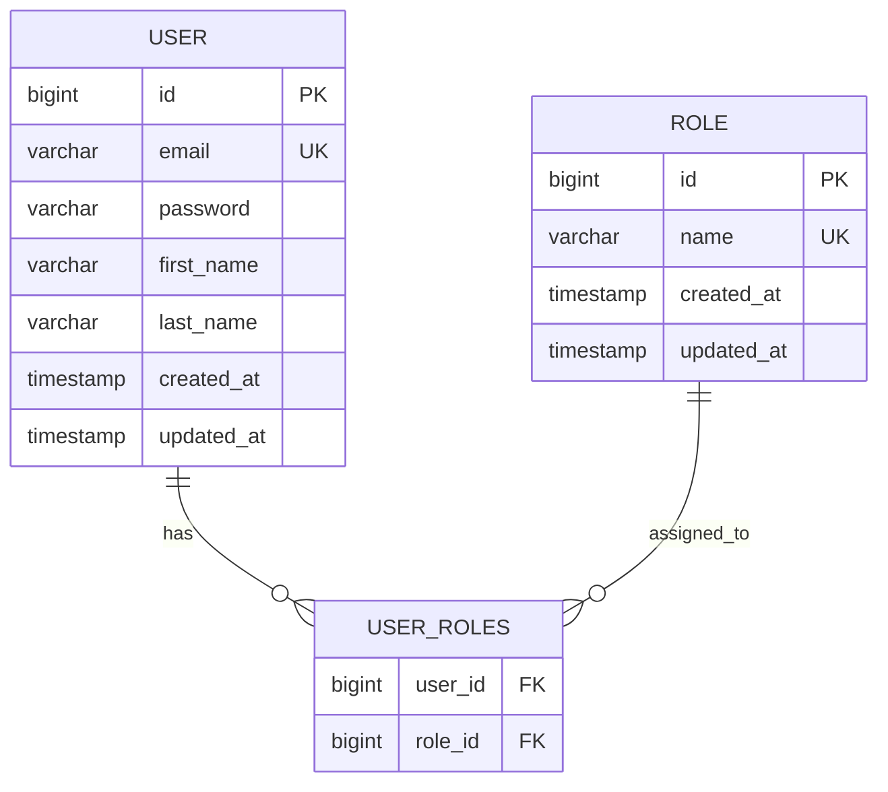
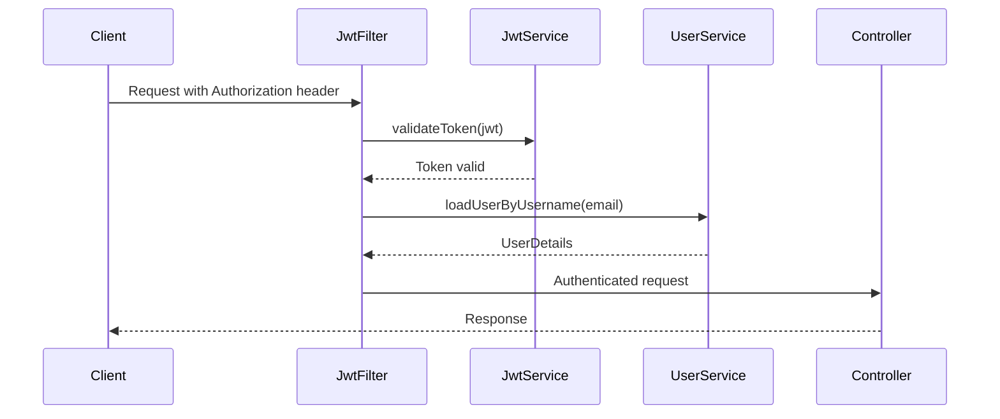

# Project Architecture Blueprint

*Generated on September 25, 2025*

## Executive Summary

This document provides a comprehensive architectural analysis of the **auth-service**, a Spring Boot 3.5.6 authentication and authorization microservice built with Java 21. The application implements a **Clean Architecture** pattern with layered separation and follows modern Spring Boot conventions for enterprise-grade security services.

## 1. Architecture Detection and Analysis

### Technology Stack
- **Framework**: Spring Boot 3.5.6
- **Language**: Java 21 
- **Database**: PostgreSQL (production), H2 (testing)
- **Security**: Spring Security 6.x with JWT authentication
- **ORM**: Spring Data JPA with Hibernate
- **Migration**: Flyway
- **Mapping**: MapStruct 1.6.3
- **Documentation**: OpenAPI 3 (SpringDoc)
- **Build Tool**: Maven
- **Containerization**: Docker with PostgreSQL

### Architectural Pattern
The application implements a **Layered Architecture** with Clean Architecture principles:
- **Presentation Layer** (Controllers)
- **Application Layer** (Services)
- **Domain Layer** (Entities, DTOs)
- **Infrastructure Layer** (Repositories, Configuration)

## 2. Architectural Overview

### Guiding Principles
1. **Separation of Concerns**: Clear layer boundaries with specific responsibilities
2. **Dependency Inversion**: Dependencies point inward through interfaces
3. **Single Responsibility**: Each component has a focused purpose
4. **Security by Default**: JWT-based stateless authentication with role-based authorization
5. **Data Integrity**: Transaction management and validation at multiple layers
6. **Observability**: Comprehensive logging and error handling

### Architectural Boundaries
- **API Boundary**: REST controllers expose public interfaces
- **Service Boundary**: Business logic encapsulation in service layer
- **Data Boundary**: Repository pattern abstracts data access
- **Security Boundary**: JWT filter chain manages authentication/authorization

## 3. Architecture Visualization



### Component Interaction Diagram



## 4. Core Architectural Components

### 4.1 Presentation Layer Components

#### AuthController
- **Purpose**: Handles authentication endpoints (login, register, test)
- **Responsibilities**: 
  - Request/response handling
  - Input validation delegation
  - HTTP status code management
- **Internal Structure**: REST controller with OpenAPI documentation
- **Interaction Patterns**: Delegates to AuthService, returns DTOs
- **Extension Points**: Additional auth methods, OAuth integration points

#### UserController  
- **Purpose**: User management operations
- **Responsibilities**: CRUD operations, user profile management
- **Security**: Role-based access control (@PreAuthorize)
- **Extension Points**: User profile features, admin operations

### 4.2 Application Layer Components

#### AuthService
- **Purpose**: Core authentication business logic
- **Responsibilities**:
  - User registration with role assignment
  - Login authentication with JWT generation
  - Security context management
- **Internal Structure**: 
  - Transactional service methods
  - Exception handling with custom exceptions
  - Integration with Spring Security
- **Dependencies**: UserRepository, RoleRepository, JwtService, PasswordEncoder
- **Extension Points**: Multi-factor authentication, social login integration

#### JwtService
- **Purpose**: JWT token lifecycle management
- **Responsibilities**:
  - Token generation with user claims
  - Token validation and parsing
  - Expiration management
- **Extension Points**: Refresh token support, token revocation

### 4.3 Domain Layer Components

#### User Entity
- **Purpose**: Core user domain model
- **Responsibilities**:
  - User data representation
  - Spring Security UserDetails implementation
  - JPA entity lifecycle management
- **Design Patterns**: Entity pattern, UserDetails adapter
- **Relationships**: Many-to-many with Role entity
- **Extension Points**: Additional user properties, profile features

#### Role Entity
- **Purpose**: Role-based access control model
- **Responsibilities**: Permission representation with enum-based role names
- **Extension Points**: Hierarchical roles, fine-grained permissions

### 4.4 Infrastructure Layer Components

#### Repository Layer
- **Pattern**: Spring Data JPA repositories
- **UserRepository**: User query operations with email-based lookup
- **RoleRepository**: Role management with name-based queries
- **Extension Points**: Custom query methods, specification pattern

## 5. Architectural Layers and Dependencies

### Layer Structure
```
┌─────────────────────────┐
│   Presentation Layer    │ ← Controllers, DTOs
├─────────────────────────┤
│   Application Layer     │ ← Services, Business Logic  
├─────────────────────────┤
│     Domain Layer        │ ← Entities, Domain Models
├─────────────────────────┤
│  Infrastructure Layer   │ ← Repositories, External APIs
└─────────────────────────┘
```

### Dependency Rules
- **Inward Dependencies**: All dependencies point toward the domain layer
- **Interface Abstractions**: Repositories defined as interfaces in domain, implemented in infrastructure
- **Service Isolation**: Services depend on repository interfaces, not implementations
- **DTO Boundary**: Controllers work with DTOs, services work with entities

### Dependency Injection Patterns
- **Constructor Injection**: Primary DI pattern using @Autowired
- **Service Registration**: @Service, @Repository, @Component annotations
- **Configuration**: @Configuration classes for security and cross-cutting concerns

## 6. Data Architecture

### Domain Model Structure


### Data Access Patterns
- **Repository Pattern**: Spring Data JPA interfaces with method query derivation
- **Entity Mapping**: JPA annotations with table/column mapping
- **Relationship Mapping**: Many-to-many mapping with join table
- **Auditing**: JPA lifecycle callbacks (@PrePersist, @PreUpdate)

### Data Migration Strategy
- **Flyway Integration**: Version-controlled database migrations
- **Migration Scripts**: Located in `src/main/resources/db/migration`
- **Environment Separation**: Different configurations for test/production

## 7. Cross-Cutting Concerns Implementation

### 7.1 Authentication & Authorization
- **Authentication Model**: JWT-based stateless authentication
- **User Identity**: Email as username with encrypted passwords
- **Permission Model**: Role-based access control with Spring Security authorities
- **Security Boundaries**: Filter chain with JWT validation before controller access

#### Implementation Pattern:
```java
@PreAuthorize("hasRole('ADMIN')")
public ResponseEntity<List<UserDTO>> getAllUsers() {
    // Admin-only endpoint
}
```

### 7.2 Error Handling & Resilience
- **Global Exception Handler**: Centralized error handling with @RestControllerAdvice
- **Custom Exceptions**: Domain-specific exceptions with error codes
- **Error Response Format**: Standardized ErrorDTO with consistent structure
- **Logging Strategy**: Structured logging with correlation of errors

#### Exception Hierarchy:
```
AuthException (Base)
├── EmailAlreadyExistsException
├── UserNotFoundException  
├── InvalidCredentialsException
└── RoleNotFoundException
```

### 7.3 Validation
- **Input Validation**: Bean Validation (JSR-303) annotations on DTOs
- **Method-Level Validation**: @Valid annotations on controller parameters
- **Entity Validation**: JPA validation constraints on entity fields
- **Custom Validation**: Business rule validation in service layer

### 7.4 Configuration Management
- **Property Sources**: application.properties with environment variable overrides
- **Profile-Specific Config**: application-test.properties for testing
- **External Configuration**: Docker environment variables for deployment
- **Security Configuration**: Separate configuration class for security setup

## 8. Service Communication Patterns

### API Design Patterns
- **RESTful Design**: Resource-based URLs with HTTP method semantics
- **Content Negotiation**: JSON as primary media type
- **Status Code Usage**: Semantic HTTP status codes for different scenarios
- **CORS Configuration**: Configurable cross-origin resource sharing

### Authentication Flow


## 9. Java Architectural Patterns

### Spring Boot Patterns
- **Auto-Configuration**: Leverage Spring Boot starters for rapid setup
- **Application Properties**: Externalized configuration with property binding
- **Component Scanning**: Automatic bean discovery with package-based scanning
- **Conditional Beans**: Environment-specific bean registration

### Spring Security Integration
- **Security Filter Chain**: Custom JWT filter integration
- **Authentication Manager**: Configured authentication with UserDetailsService
- **Method Security**: Annotation-based authorization on service methods
- **CORS Configuration**: Global CORS setup for cross-origin requests

### Spring Data JPA Patterns
- **Repository Abstraction**: Interface-based data access with query derivation
- **Entity Lifecycle**: JPA callbacks for audit trail management
- **Transactional Boundaries**: Method-level transaction management
- **Database Migration**: Flyway integration for schema versioning

### Dependency Injection Patterns
- **Constructor Injection**: Primary injection mechanism for required dependencies
- **Field Injection**: Limited use with @Autowired for framework components
- **Configuration Properties**: @Value annotation for external configuration injection

## 10. Implementation Patterns

### Service Implementation Patterns
- **Transactional Services**: @Transactional annotations for data consistency
- **Exception Translation**: Service-layer exceptions mapped to HTTP responses
- **DTO Transformation**: MapStruct-based entity-DTO mapping
- **Security Context Access**: SecurityContextHolder for current user access

### Repository Implementation Patterns
- **Query Method Derivation**: Spring Data method name conventions
- **Custom Queries**: @Query annotations for complex queries
- **Specification Pattern**: Dynamic query building capability
- **Auditing Support**: Automatic timestamp management

### Mapping Patterns
- **MapStruct Integration**: Compile-time DTO-entity mapping generation
- **Custom Mapping Logic**: Complex transformations with manual mapping methods
- **Null Handling**: Configured unmapped property policies

## 11. Testing Architecture

### Testing Strategy Alignment
- **Unit Testing**: Service and repository layer isolation testing
- **Integration Testing**: Full application context testing
- **Security Testing**: Authentication and authorization verification
- **Database Testing**: In-memory H2 database for isolated testing

### Test Boundary Patterns
- **Service Layer Testing**: Mock repository dependencies
- **Repository Testing**: @DataJpaTest slice testing
- **Controller Testing**: @WebMvcTest with security context
- **End-to-End Testing**: @SpringBootTest with test containers

### Test Configuration
- **Profile Separation**: application-test.properties for test-specific config
- **Test Database**: H2 in-memory database with schema auto-creation
- **Flyway Disabled**: Skip migrations in test environment
- **Security Mocking**: Test-specific JWT configuration

## 12. Deployment Architecture

### Container Strategy
- **Docker Compose**: Local development environment with PostgreSQL
- **Service Containerization**: Spring Boot application containerization ready
- **Database Persistence**: Volume mounting for data persistence
- **Health Checks**: Database connectivity verification

### Environment Configuration
- **Environment Variables**: Database connection and JWT secret externalization
- **Property Override**: Spring property placeholder resolution
- **Profile Activation**: Environment-specific application behavior
- **Port Configuration**: Configurable server port binding

### Database Deployment
- **PostgreSQL**: Production database with connection pooling
- **Migration Management**: Flyway automatic migration execution
- **Schema Validation**: Migration validation on startup
- **Backup Strategy**: Volume-based data persistence

## 13. Extension and Evolution Patterns

### Feature Addition Patterns
- **New Endpoint Addition**: 
  1. Create DTO classes for request/response
  2. Add controller method with validation
  3. Implement service method with business logic
  4. Add repository methods if needed
  5. Update security configuration if required

- **Authentication Method Extension**:
  1. Create new authentication provider
  2. Extend security configuration
  3. Add corresponding service methods
  4. Update JWT service for new token types

### Modification Patterns
- **Role System Extension**: 
  - Add new role types to RoleName enum
  - Update database migration scripts
  - Modify security expressions as needed

- **User Profile Enhancement**:
  - Add fields to User entity
  - Create migration scripts
  - Update DTOs and mappers
  - Extend validation rules

### Integration Patterns
- **External Service Integration**:
  1. Create client interface in domain layer
  2. Implement client in infrastructure layer
  3. Register as Spring bean with configuration
  4. Use circuit breaker pattern for resilience

## 14. Architectural Pattern Examples

### Layer Separation Examples

#### Interface Definition and Implementation Separation
```java
// Domain layer interface
public interface UserRepository extends JpaRepository<User, Long> {
    Optional<User> findByEmail(String email);
    boolean existsByEmail(String email);
}

// Infrastructure layer (auto-implemented by Spring Data)
// Actual implementation generated at runtime
```

#### Cross-Layer Communication Pattern
```java
@RestController
public class AuthController {
    @Autowired
    private AuthService authService; // Application layer dependency
    
    @PostMapping("/login")
    public ResponseEntity<AuthDTO> login(@Valid @RequestBody LoginDTO request) {
        AuthDTO response = authService.login(request); // Service delegation
        return ResponseEntity.ok(response); // HTTP response handling
    }
}
```

#### Dependency Injection Examples
```java
@Service
public class AuthService {
    // Constructor injection pattern
    private final UserRepository userRepository;
    private final RoleRepository roleRepository;
    private final PasswordEncoder passwordEncoder;
    private final JwtService jwtService;
    
    @Autowired
    public AuthService(UserRepository userRepository, 
                      RoleRepository roleRepository,
                      PasswordEncoder passwordEncoder,
                      JwtService jwtService) {
        this.userRepository = userRepository;
        this.roleRepository = roleRepository;
        this.passwordEncoder = passwordEncoder;
        this.jwtService = jwtService;
    }
}
```

### Component Communication Examples

#### Service Invocation Pattern
```java
@Transactional
public AuthDTO register(RegisterDTO request) {
    // Validation layer
    if (userRepository.existsByEmail(request.email())) {
        throw new EmailAlreadyExistsException("Este email já está em uso");
    }
    
    // Entity creation with mapping
    User user = UserMapper.INSTANCE.toEntity(request);
    user.setPassword(passwordEncoder.encode(request.password()));
    
    // Repository layer interaction
    User savedUser = userRepository.save(user);
    
    // Cross-service communication
    String token = jwtService.generateToken(savedUser);
    
    return AuthMapper.toAuthDTO(savedUser, token, expiresAt);
}
```

#### Event Publication Pattern
```java
// JPA Lifecycle callbacks for auditing
@PrePersist
protected void onCreate() {
    createdAt = LocalDateTime.now();
    updatedAt = LocalDateTime.now();
}

@PreUpdate  
protected void onUpdate() {
    updatedAt = LocalDateTime.now();
}
```

### Extension Point Examples

#### Configuration-Driven Extension
```java
@Configuration
@EnableWebSecurity
public class SecurityConfig {
    
    @Value("${app.cors.allowed-origins}")
    private String corsAllowedOrigins; // External configuration
    
    @Bean
    public CorsConfigurationSource corsConfigurationSource() {
        // Configuration-driven CORS setup
        CorsConfiguration configuration = new CorsConfiguration();
        configuration.setAllowedOriginPatterns(getAllowedOriginsList());
        return source;
    }
}
```

## 15. Architectural Decision Records

### Architectural Style Decisions

#### Decision: Layered Architecture with Clean Architecture Principles
- **Context**: Need for maintainable, testable microservice architecture
- **Decision**: Implement layered architecture with dependency inversion
- **Alternatives Considered**: Hexagonal architecture, event-driven architecture  
- **Rationale**: 
  - Spring Boot ecosystem alignment
  - Team familiarity and development speed
  - Clear separation of concerns
- **Consequences**: 
  - **Positive**: Clear boundaries, easy testing, framework integration
  - **Negative**: Some complexity for simple operations, potential over-engineering

#### Decision: JWT-Based Authentication
- **Context**: Stateless microservice requiring scalable authentication
- **Decision**: Implement JWT tokens with Spring Security
- **Alternatives Considered**: Session-based auth, OAuth2, API keys
- **Rationale**: 
  - Stateless operation for horizontal scaling
  - Industry standard approach
  - Spring Security integration
- **Consequences**:
  - **Positive**: Scalability, no server-side session storage
  - **Negative**: Token revocation complexity, larger request size

### Technology Selection Decisions

#### Decision: MapStruct for Object Mapping
- **Context**: Need efficient and maintainable DTO-entity mapping
- **Decision**: Use MapStruct with compile-time code generation
- **Alternatives Considered**: Manual mapping, ModelMapper, Dozer
- **Rationale**:
  - Compile-time safety and performance
  - Generated code inspection capability
  - Type-safe mapping with validation
- **Consequences**:
  - **Positive**: Performance, compile-time checking, maintainability
  - **Negative**: Additional build complexity, annotation maintenance

#### Decision: Flyway for Database Migrations
- **Context**: Need versioned database schema management
- **Decision**: Integrate Flyway for migration management
- **Alternatives Considered**: Liquibase, JPA DDL auto-generation
- **Rationale**:
  - Production-ready migration support
  - SQL-based migrations for clarity
  - Version control integration
- **Consequences**:
  - **Positive**: Reliable deployments, audit trail, rollback capability
  - **Negative**: Manual migration script creation, coordination overhead

## 16. Architecture Governance

### Architectural Consistency Maintenance
- **Layer Boundaries**: Package structure enforcement with clear naming conventions
- **Dependency Direction**: Regular architecture compliance checking through code reviews
- **Testing Requirements**: Minimum test coverage requirements per layer
- **Code Quality**: SonarQube integration potential for automated quality checks

### Architectural Review Processes
- **Code Review Guidelines**: Focus on layer violations and dependency direction
- **Documentation Updates**: Architecture decision tracking in ADR format
- **Migration Planning**: Impact assessment for architectural changes

## 17. Blueprint for New Development

### Development Workflow

#### Adding New Authentication Features
1. **Analysis Phase**:
   - Identify affected layers and components
   - Plan DTO and entity changes
   - Design security implications

2. **Implementation Sequence**:
   - Update domain entities and DTOs
   - Add repository methods if needed
   - Implement service business logic
   - Create/update controller endpoints
   - Update security configuration
   - Add comprehensive tests

3. **Integration Steps**:
   - Database migration scripts
   - Configuration property updates
   - Documentation updates
   - API documentation refresh

#### Adding New User Management Features
1. **Domain Modeling**: Extend User entity with new attributes
2. **Migration Strategy**: Create Flyway migration scripts
3. **Service Extension**: Add business logic in UserService
4. **API Design**: RESTful endpoint design with proper status codes
5. **Security Integration**: Role-based access control configuration
6. **Testing Strategy**: Unit and integration test coverage

### Implementation Templates

#### Controller Template
```java
@RestController
@RequestMapping("/api/feature")
@Tag(name = "Feature", description = "Feature management endpoints")
public class FeatureController {
    
    @Autowired
    private FeatureService featureService;
    
    @Operation(summary = "Description")
    @PostMapping
    public ResponseEntity<FeatureDTO> createFeature(@Valid @RequestBody CreateFeatureDTO request) {
        FeatureDTO response = featureService.createFeature(request);
        return ResponseEntity.status(HttpStatus.CREATED).body(response);
    }
}
```

#### Service Template  
```java
@Service
@Transactional
public class FeatureService {
    
    private final FeatureRepository featureRepository;
    
    @Autowired
    public FeatureService(FeatureRepository featureRepository) {
        this.featureRepository = featureRepository;
    }
    
    public FeatureDTO createFeature(CreateFeatureDTO request) {
        // Business logic implementation
        // Exception handling
        // Entity persistence
        // DTO mapping and return
    }
}
```

### Common Pitfalls

#### Architecture Violations to Avoid
- **Layer Skipping**: Controllers directly accessing repositories
- **Dependency Direction**: Domain layer depending on infrastructure
- **Transaction Boundaries**: Missing @Transactional annotations on service methods
- **Security Bypass**: Endpoints missing security configuration

#### Performance Considerations
- **N+1 Query Problem**: Use @EntityGraph or JOIN FETCH for related entities
- **Transaction Scope**: Keep transactions focused and minimal
- **DTO Overhead**: Balance between data transfer efficiency and security

#### Testing Blind Spots
- **Security Testing**: Verify authentication and authorization for all endpoints
- **Exception Scenarios**: Test all custom exception handling paths
- **Integration Points**: Test service integrations with proper mocking

---

*This blueprint should be updated as the architecture evolves. Key indicators for updates include major dependency changes, new architectural patterns adoption, or significant feature additions that change the core architectural approach.*

## Recommendations for Architecture Evolution

1. **Observability Enhancement**: Consider adding distributed tracing and metrics
2. **Caching Strategy**: Implement Redis for session management and performance
3. **API Versioning**: Prepare strategy for backward-compatible API evolution  
4. **Event-Driven Evolution**: Consider domain events for complex business workflows
5. **Documentation Automation**: Integrate architectural testing tools like ArchUnit